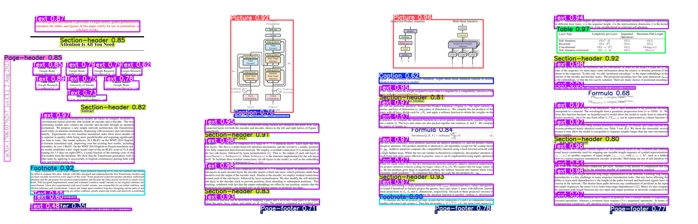
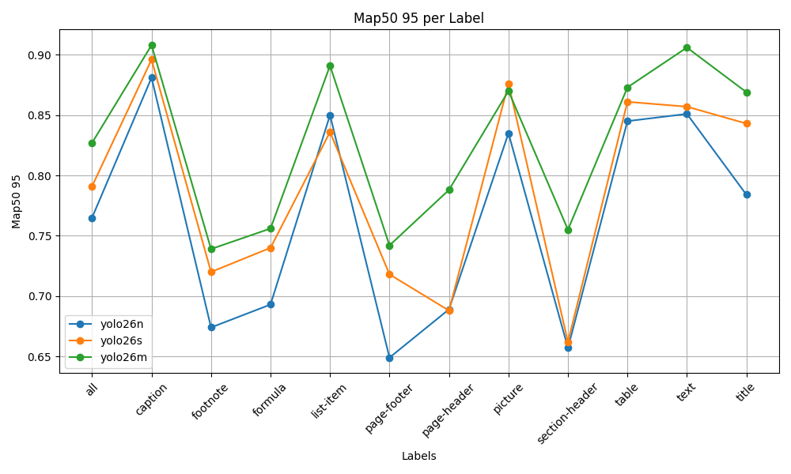
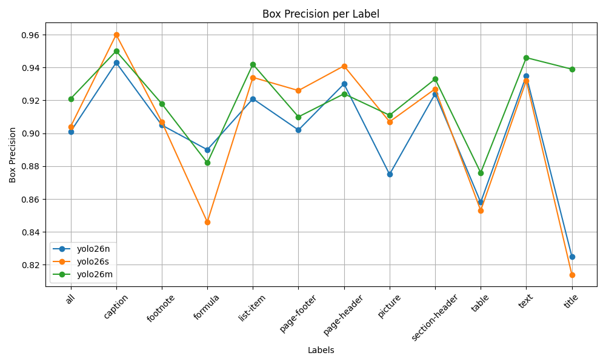
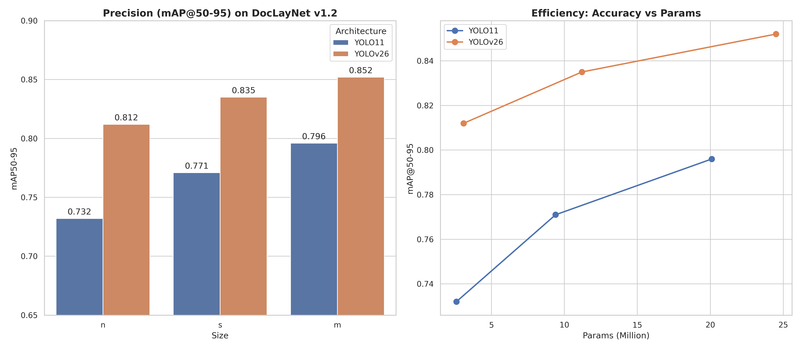

<div id="top"></div>
<br/>
<br/>
<br/>


<p align="center">
  
</p>
<h1 align="center">
    <a href="https://github.com/Armaggheddon/yolo11_doc_layout">Yolo Document Layout 🔎📄</a>
</h1>

<div align="center">

<p align="center">
  <a href="https://huggingface.co/Armaggheddon/yolo26-document-layout">
    
  </a>
  <a href="https://huggingface.co/spaces/Armaggheddon/yolo26-document-layout">
    
  </a>
  <a href="https://huggingface.co/Armaggheddon/yolo26-document-layout">
    
  </a>
  <a href="https://huggingface.co/Armaggheddon/yolo11-document-layout">
    
  </a>
  <a href="https://github.com/Armaggheddon/yolo11_doc_layout/blob/main/LICENSE">
    
  </a>
</p>
</div>

Official repository for Document Layout Analysis using the latest YOLO architectures. This project provides fine-tuned models for high-precision layout detection on the **DocLayNet v1.2** dataset.

## 🧐 Overview

This repository has transitioned from a YOLOv11-only project to a multi-generational hub supporting both YOLOv11 and the new **YOLOv26**. 

- **main branch**: Tracks the latest developments, currently featuring YOLOv26 performance on DocLayNet v1.2.
- **yolo11 branch**: Preserves the legacy state of the initial YOLOv11 release finetuned on DocLayNet.

## 🚀 Get Started
You can easily use the pre-trained models hosted on the Hugging Face Hub for your own document analysis tasks. Or try out the models directly in your browser using the Hugging Face Spaces demo.

### 1. Installation
Clone this repository and install the required dependencies:
```bash
git clone https://github.com/Armaggheddon/yolo_document_layout.git
cd yolo_document_layout
pip install -r requirements.txt
```

### 2. Run Inference
The following script downloads the YOLO26 nano model and runs inference on a local image. 

```bash
from pathlib import Path
from huggingface_hub import hf_hub_download
from ultralytics import YOLO

# Define the local directory to save the models
DOWNLOAD_PATH = Path("./models")
DOWNLOAD_PATH.mkdir(exist_ok=True)

# Choose which model to use
# 0: nano, 1: small, 2: medium
model_files = [
    "yolo26n_doc_layout.pt",
    "yolo26s_doc_layout.pt",
    "yolo26m_doc_layout.pt"
]
selected_model_file = model_files[0]  # Change index to select different model

# Download the model from the Hugging Face Hub
model_path = hf_hub_download(
    repo_id="Armaggheddon/yolo26-document-layout",
    filename=selected_model_file,
    repo_type="model",
    local_dir=DOWNLOAD_PATH
)

# Initialize the YOLO model
model = YOLO(model_path)

# Run inference on an image
# Replace 'path/o/your/document.jpg' with your file
results = model("path/to/your/document.jpg")

results[0].save(filename="result.jpg")
```

## ✨ The Models: Nano, Small, and Medium
Three model variants are available, each offering a different balance of accuracy and computational efficiency:

| Model Filename | Size | Recommended Use Case |
| :--- | :---: | :--- |
| yolo26n_doc_layout.pt | Nano | (Recommended) Best for real-time applications and environments with limited resources. Offers an excellent balance of speed and high-quality detections. |
| yolo26s_doc_layout.pt | Small | A great mid-point, providing a boost in accuracy over the nano model with a moderate increase in computational cost. |
| yolo26m_doc_layout.pt | Medium | The highest accuracy model, suitable for offline processing or when maximum precision is the top priority. |

## 📊 Performance Highlights
The YOLOv26 models demonstrate significant improvements in mAP scores compared to the YOLOv11 counterparts, with the medium variant achieving the highest performance. The nano model, while being the most lightweight, still delivers impressive results, making it a strong choice for many applications.

| mAP@50-95 (Strict IoU) | Precision (Box Quality) |
| :---: | :---: |
| |  |


Compared to the YOLOv11 models, the YOLOv26 variants show a marked increase in both mAP50-95 and mAP50 metrics, underscoring the advancements in the architecture and training techniques used in YOLOv26.

| Model | mAP50-95 | mAP50 | Params (M) |
| :--- | :---: | :---: | :---: |
| **YOLO11n-doc** | 0.732 | 0.841 | 2.6 |
| **YOLO11s-doc** | 0.771 | 0.871 | 9.4 |
| **YOLO11m-doc** | 0.796 | 0.887 | 20.1 |
| **YOLOv26n-doc** | **0.812** | **0.908** | 3.1 |
| **YOLOv26s-doc** | **0.835** | **0.923** | 11.2 |
| **YOLOv26m-doc** | **0.852** | **0.936** | 24.5 |




## 📚 About the Dataset
The models are trained and evaluated on the [**DocLayNet v1.2**](https://huggingface.co/datasets/docling-project/DocLayNet-v1.2) dataset. The difference bewteen DocLayNet v1.2 and v1.0 consists only in the dataset packaging, where in the v1.2 the dataset rows embed the image data of the document. **The 2 datasets are identical** in terms of content and annotations, and the same training and evaluation scripts can be used for both versions.

The dataset contains a large and diverse collection of documents annotated with 11 layout categories: 
- `Caption`, `Footnote`, `Formula`, `List-item`, `Page-footer`, `Page-header`, `Picture`, `Section-header`, `Table`, `Text`, and `Title`.

The original dataset is in COCO format, and was converted to the required YOLO format using the [`doclaynet2yolo.py`](doclaynet2yolo.py) script. All models were trained at 1280x1280 resolution to ensure high-quality detections on documents with small text elements like `Footnote` and `Caption`.


## 📂 Training Runs and Validation
The `runs` directory contains all the artifacts generated during the training of the nano, small, and medium models. This includes training metrics, configuration files, and sample batches, providing full transparency into the training process.

Each sub-directory (e.g., `runs/train_yolo26n`) corresponds to a specific training run and contains:

- `args.yaml`: The complete set of training arguments and hyperparameters used.
- **Plots**: Visualizations of performance metrics like mAP, precision, and recall curves (e.g., `results.png`, `BoxP_curve.png`).
- **Sample Batches**:
  - `train_batch*.jpg`: Images from the training set with ground truth labels.
  - `val_batch*_labels.jpg`: Validation images with ground truth labels.
  - `val_batch*_pred.jpg`: Model predictions on the same validation images, allowing for a direct comparison.

The validation results of each training run are also available in the respective `val_yolo26X` folder.  


## ⚖️ License
This project is licensed under the Apache 2.0 License.
